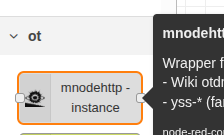

# node-red-contrib-mnodehttp


### dependencies

- Node-red

### installation

* Manual way. In terminal

```bash
cd ~/.node-red
npm i https://github.com/yOyOeK1/node-red-contrib-mnodehttp/raw/refs/heads/main/node-red-contrib-mnodehttp-latest.tgz
```

* After this restart *node-red* service icon of node will be in node list



* Drag and drop it. Do configuration of instance. Your done.

* In your web browser of your choice enter http://localhost:8083

This is basic setup more about [**yss** on wiki](https://github.com/yOyOeK1/oiyshTerminal/wiki/otdm-yss), more about [**sites**  on wiki](https://github.com/yOyOeK1/oiyshTerminal/wiki/otdm-yss#2-the-basic-page)


### check list v0.0.2

- [x] node in node-red-contrib first steps
- [ ] revamp readme
- [x] prevent having two instances on same config
- [x] can do some configuration
  - [x] path to yss - need some fixing and checking if it's working
  - [x] paths to sites - need to be checked
  - [x] ui clean up in configuration of the node
  - [x] readme / doc
- [x] ws in to *mnodehttp* instance
  - [x] ws out to node.
  - [x] node to ws.